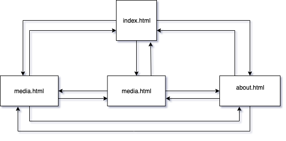
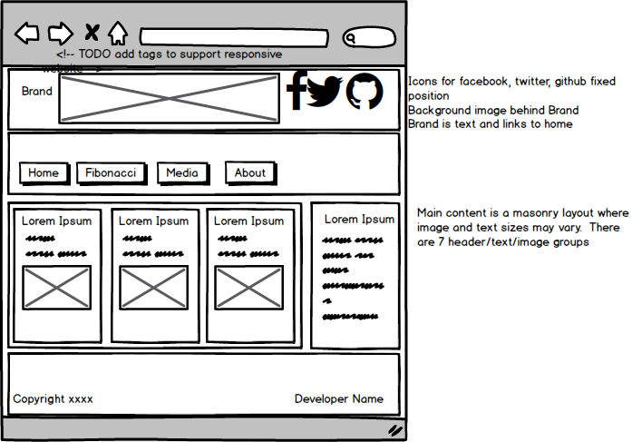
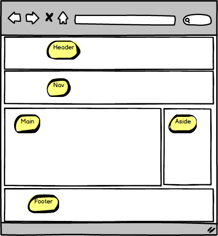
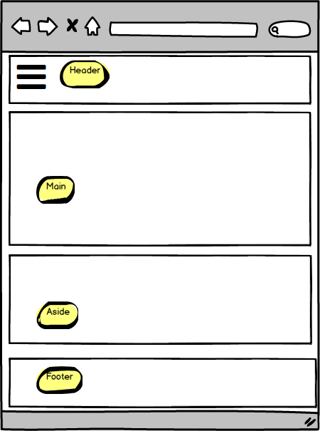
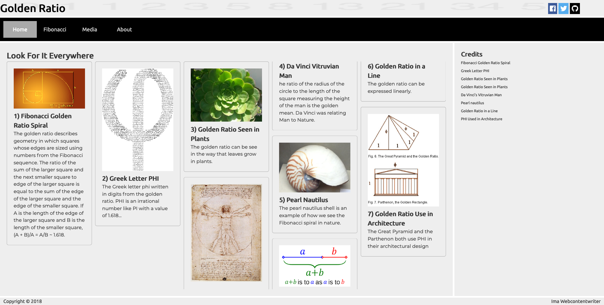

# Golden Ratio

**Responsive Web Design | Layout Techniques | Working with Media**  

In this assignment we build a multi page responsive website. It will require flex, grid and column layouts.  The pages and assets are included in this repo.  There are `TODO`s in each page that provide pointers to what needs to be done in order to complete the HTML in the page.  There is also an empty style sheet `css/style.css` that we'll work on.

***Learning Objectives***  

1. Multi page layout with external links
2. Tabular data content: table element/tag
3. Embed video
4. Host video
5. Host audio
6. Layout: display column, relative, absolute, fixed
layout,	flex, grid
7. Responsive Web: Media queries
8. Icons: font awesome
9. Typography: google fonts
10. Interactive CSS	:target, :hover
11. Variable property values in CSS: colors 
12. Reading designs


See the design folder for comps and wireframes.  All interpage navigation takes place through a nav bar. The information architecture diagram indicates that every page is available from every other page and this is all via the nav bar.  It is a mobile first nav bar with a hamburger.  

.

## HTML
See `TODO`'s for location of HTML changes
1. Add `<title>` to all 4 pages. 
 - index.html: "Golden Ratio"
 - fibonacci.html: "Golden Ratio: Fibonacci"
 - media.html: "Golden Ratio: Media"
 - about.html: "Golden Ratio: About"

2. Add meta tags to support responsive website to all pages.
```
<meta name="viewport" content="width=device-width, initial-scale=1.0">
<meta http-equiv="X-UA-Compatible" content="ie=edge">
```

3. Add favicon to all pages.  
```
<link rel="icon" type="image/png" href="images/phi_640.png">
```
4. Add list items for social links to `icon-bar` on all pages
```
 <li>
    <a target="_blank" href="https://www.facebook.com" class="facebook"><i class="fab fa-facebook"></i></a>
    </li>
    <li>
        <a target="_blank" href="https://www.twitter.com" class="twitter"><i class="fab fa-twitter"></i></a>
    </li>
    <li>
        <a target="_blank" href="https://www.github.com" class="github"><i class="fab fa-github"></i></a>
  </li>
```
5. Add hamburger and brand to all headers.
```
  <a class="toggle open" href="#nav">&#9776;</a>
  <h1 class="brand"><a href="./index.html">Golden Ratio</a></h1>
```
6. Add list items with navigation and set current page active.  The example below is setting the Home page (index.html) to active.
```
 <li class="active">
    <a href="#">Home</a>
  </li>
  <li class="">
      <a href="fibonacci.html">Fibonacci</a>
  </li>
  <li>
      <a href="media.html">Media</a>
  </li>
  <li>
      <a href="about.html">About</a>
  </li>
  ```
7. Add contents to Footer on all pages.  Use the code below, but update the copyright date and use your name for the author.
```
<ul class="copyright">
  <li>Copyright &copy; 2018</li>
  <li> Ima Webcontentwriter</li>
</ul>
```
8. Wrap `header` thru `footer` tags in a `<div>`.  Add class `container` to the div on `index.html` and `fibonacci.html`.  Add class `single-col-container` to the dev on `media.html` and `fibonacci.html`. This will be used for applying grid layout. 
9. Masonry effect on `index.html`: Wrap all `article` elements in a `div` with class `golden-mason`.
10. Credits on `index.html`: Wrap the `ul` in the `aside` in a `div` with the class `credits`.
11. On the `fibonacci.html` page, add a `table` elements with 3 columns. The first column should contain the value of the row (0-6), the second should contain the sum of i and the previous value of i (1,1,2,3,5,8). The third columns should contain the value of the second column divided by the second column in the previous row (na, 1, 2, 1.5, 1.7, 1.6, 1.625).  See the comp for questions about the data.  On the first rows use `<th>` and  `scope="col"` on the columns 2 and 3.  On the remaining rows set use `<th>` and `scope="row"` on the first column.  This is to improve accessibility.
12.  On th `fibonacci.html` pages, add picture of Fibonacci, the man, and his book.
```
 <figure class="fibonnaci">
      
      <figcaption>Leonardo Bonacci, aka Fibonacci</figcaption>
  </figure>
  <figure class="book-of-calc">
      
      <figcaption>The Book of Calculation <br>by Fibonacci</figcaption>
  </figure>
```
13. On the `media.html` page wrap the audio in a `div` with class `audio-container`.  The div should enclose both the head and audio elements.  Then wrap each video iframe responsive container and head element in a `div` with class `frame-container`.
14. On the `about.html` page add the XKCD clickable comic in a container.
```
    <div class="xkcd-container">
      <a href="https://xkcd.com/spiral/" target="_blank">
        
      </a>
    </div>
```
15. On the `about.html` page add class `learning-objectives` to the ordered list.

## CSS

CSS code needs to entered into the style.css file in order to make this page match the comps.  Be sure to do the HTML updates first.  As you add these code snippets add comments so that you can identify the sections of the page(s) you expect them to affect, similar to the comments in the instructions.  Be sure to preview after adding a chunk of CSS to see what the effect is.

1. Reset the browser defaults.
```
* {
  box-sizing: border-box;
  margin: 0;
  padding: 0;
}
```
2. Add variable for color and font.
```
:root {
  --main-bg-color: white;
  --main-text-color: #353535;
  --container-bg-color: rgb(238, 238, 238);
  --nav-bg-color: black;
  --nav-text-color: lightgray;
  --nav-hover-color: darkgray;
  --nav-active: white;
  --mason-border-color: #999;
  --brand-color: black;
  --font-serif-titles: 'Ubuntu', serif;
  --font-serif-text: 'Montserrat', serif;
  --container-bg-color: #eeeeee;
  --masonry-bg-color: #fff;
  --masonry-link: black;
  --facebook-bg: #3B5998;
  --twitter-bg: #55ACEE;
  --github-bg: #000;
  --icon-hover: goldenrod;
  --icon-color: white;
  --credit-hover-color: white;
  --credit-hover-bg: black;
  --calc-table-border: #ddd;
  --math-color: white;
  --math-bg-color: black;
}
```
3. Apply fonts to major elements.
```
h1,
h2,
h3,
h4,
h5,
h6,
footer,
h1 a,
li a {
  font-family: var(--font-serif-titles);
}
figcaption {
  font-family: var(--font-serif-titles);
  font-size: .7rem
}
p {
  font-family: var(--font-serif-text);
}
```
4. Style brand.
```
.brand a {
  color: var(--brand-color);
  text-decoration: none;
}
```
5. Set up mobile first grid for layout.
```
.container {
  display: grid;
  grid-template-columns: 1fr;
  grid-gap: 5px;
}
```
6. Apply basic styles to container items.
```
.single-col-container>*,
.container>* {
  color: var(--main-text-color);
  line-height: 1.5;
  background: var(--container-bg-color);
}

.single-col-container nav,
.container nav {
  padding: 10px;
}

.container>aside,
section {
  padding: 20px;
}

footer {
  padding: 0 10px;
}
```
7. Apply nav styling.
```
.single-col-container nav,
.container nav {
  background-color: var(--nav-bg-color);
}

nav ul {
  list-style: none;
  margin: 0;
  padding: 0;
}

nav a {
  color: var(--nav-text-color);
  text-decoration: none;
}

nav a:hover {
  text-decoration: none;
}

a.toggle {
  text-decoration: none;
}

nav .active {
  background-color: var(--nav-hover-color);
  height: 50px;
  line-height: 50px;
}

nav li {
  text-align: center;
}

nav .active a {
  color: var(--nav-active);
}
```
8. Set up media query for large screen sizes and devices.
```
@media only screen and (min-width: 600px) {

  /* grid */
  .single-col-container,
  .container {
    grid-template-columns: repeat(4, 1fr);
  }

  /* specific item styles */
  .single-col-container,
  .container header,
  .container nav,
  .container footer {
    grid-column: span 4;
  }

  .container section {
    grid-column: span 3;
  }

  /* nav styles */
  nav ul li {
    display: inline-block;
    width: 100px;

  }

  /* hide toggle */
  .toggle {
    display: none;
  }

  .header {
    width: 100%;
    height: auto;
    background-image: url("../images/fibonacci-numbers.png");
    background-repeat: no-repeat;
    background-size: 100% 100%;
  }

}
```
8. Set up media query to manage navigation on smaller devices.
```
@media only screen and (max-width: 599px) {

  #nav {
    transition: transform .3s ease-in-out;
    top: 0;
    bottom: 0;
    position: fixed;
    width: 300px;
    right: -340px;
  }

  #nav:target {
    transform: translateX(-340px);
  }

  .close {
    text-align: right;
    display: block;
    text-decoration: none;
    font-size: 3em;
    position: relative;
    top: -30px;
  }

  .open {
    text-align: left;
    color: var(--main-text-color);
    font-size: 2em;
    padding-left: 5px;
  }

}
```
9. Set up 3 column layout for masonry.
```
.golden-mason img {
  width: 100%;
}

.golden-mason article {
  padding: 20px;
  border: 1px solid var(--mason-border-color);
  border-radius: 5px;
  background-color: var(masonry-bg-color);
}

.golden-mason a:link,
.golden-mason a:visited {
  color: var(--masonry-link);
}

.golden-mason h1 {
  margin-top: 0;
  margin-left: 0.75rem;
}

.golden-mason {
  column-count: 3;
  columns: 250px;
  column-gap: 10px;
}

.golden-mason article {
  break-inside: avoid-column;
  margin-bottom: 1rem;
}

.golden-mason p {
  font-size: .9rem;
}
```
10. Set up styling for the aside text.
```
aside p {
  font-size: .9rem;
}
```
11. Set up flexbox styling for the footer.
```
ul.copyright {
  padding: 0;
  display: flex;
  list-style-type: none;
  justify-content: space-between;
}

.copyright li {
  font-size: .9rem;
}
```
12. Add styling for icon bar social links.
```
.icon-bar {
  position: fixed;
  top: 1%;
  right: 4%;
}

icon-bar ul {
  list-style-type: none;
}

.icon-bar li {
  display: inline-block;
}

.icon-bar a {
  display: block;
  text-align: center;
  padding: 5px;
  transition: all 0.3s ease;
  font-size: 20px;
}

.icon-bar a:hover {
  background-color: var(--icon-hover);
}

.facebook {
  background-color: var(--facebook-bg);
  color: var(--icon-color)
}

.twitter {
  background-color: var(--twitter-bg);
  color: var(--icon-color);
}

.github {
  background-color: var(--github-bg);
  color: var(--icon-color);
}
```
13. Style the credits.
```
.credits ul {
  list-style-type: none;
  padding: 0;
}

.credits a {
  font-size: .7em;
  text-decoration: none;
  color: var(--main-text-color);
}

.credits a:hover {
  background-color: var(--credit-hover-bg);
  color: var(--credit-hover-color);
  cursor: pointer;
}
```
14. Style the aside images on fibonacci.
```
.fib-aside {
  display: flex;
  flex-direction: column;
  align-items: center;
}

.fib-aside img {
  width: 180px;
  height: auto;
}
```
15. Style the table with Fibonacci calculations.
```
.calc-table table {
  font-family: arial, sans-serif;
  border-collapse: collapse;
  border-spacing: 0;
  width: 100%;
  border: 1px solid var(--calc-table-border);
}

.calc-table th,
.cacl-table td {
  border: 1px solid var(--calc-table-border);
  text-align: left;
  padding: 8px;
}

.calc-table tr:nth-child(even) {
  background-color: var(--calc-table-border);
}
```
16. Style the math presentation on fibonacci.html.
```
.math {
  margin: 20px auto;
  padding: 10px 30px;
  width: 200px;
  background-color: var(--math-bg-color);
  color: var(--math-color);
}
```
17. Add styling for responsive iframes.
```
.resp-container {
  position: relative;
  overflow: hidden;
  padding-top: 56.25%;
}

.resp-iframe {
  position: absolute;
  top: 0;
  left: 0;
  width: 100%;
  height: 100%;
  border: 0;
}
```
18. Provide containers for media iframes.
```
.frame-container {
  margin: 0 auto;
  width: 80%;
}

.frame-container {
  text-align: center;
}


.audio-container {
  display: grid;
  grid-template-columns: repeat(auto-fill, minmax(300px, 1fr)); /* see notes below */

  background-color: var(--nav-text-color);
  align-items: center;
}
@media only screen and (min-width: 600px) {
  .audio-container {
    grid-template-columns: auto auto;
  }
}
```
19. Provide container styling for about.html
```
.learning-objectives {
  margin: 20px;
}

.learning-objectives li {
  font-family: var(--font-serif-titles);
}

.xkcd-container img {
  width: 320px;
  height: auto;
}
```

## Wireframes
  




## Comps



